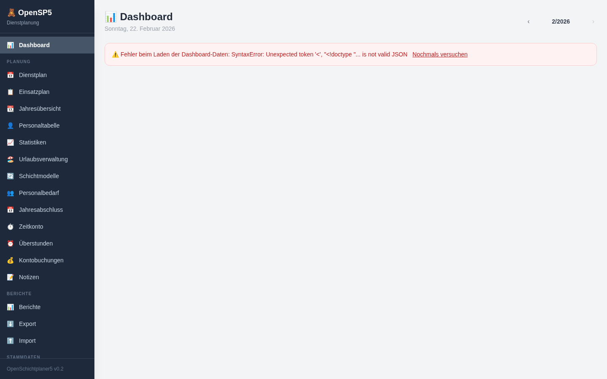
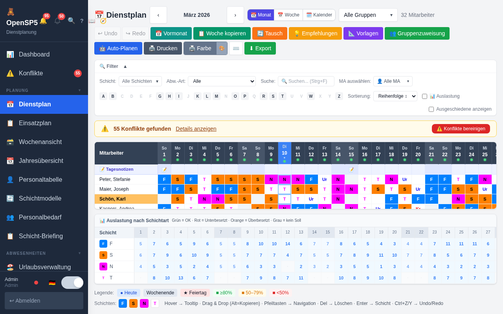
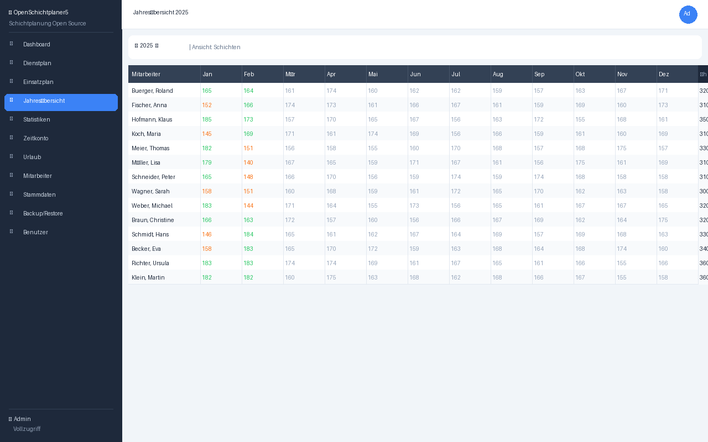
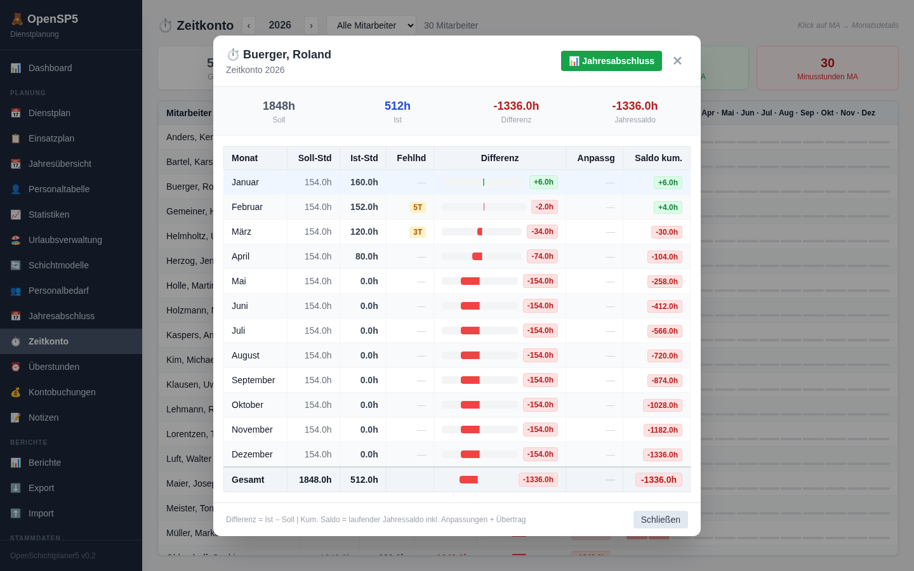
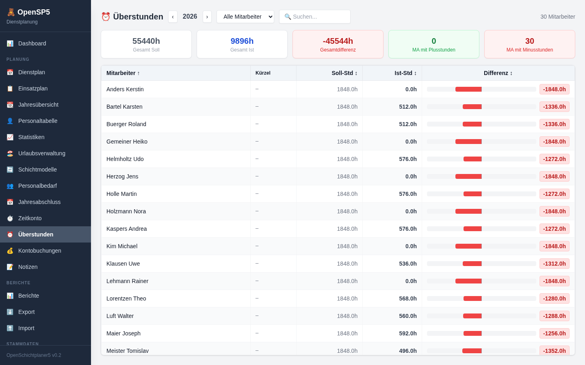
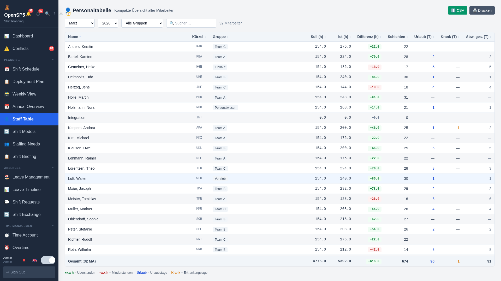
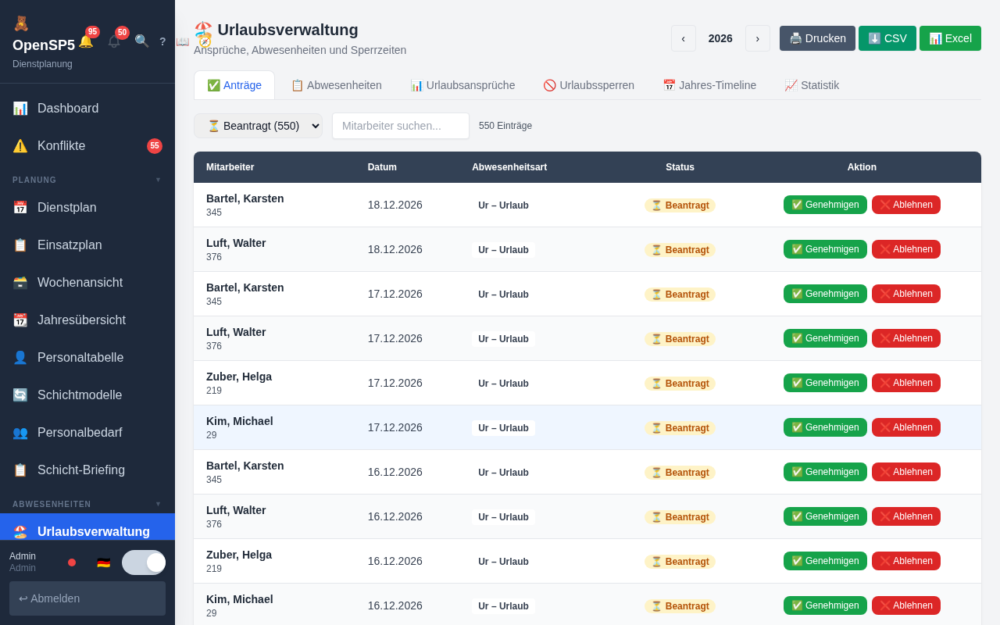
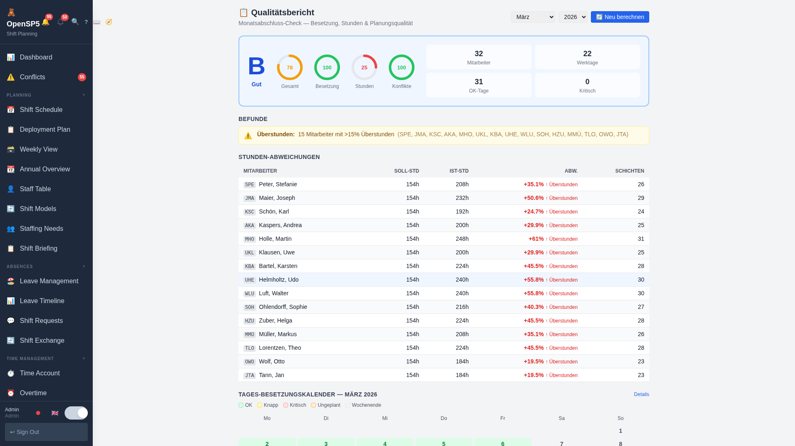
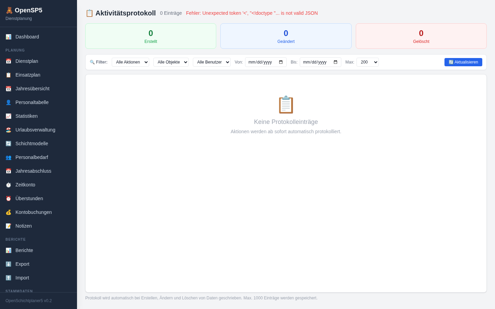
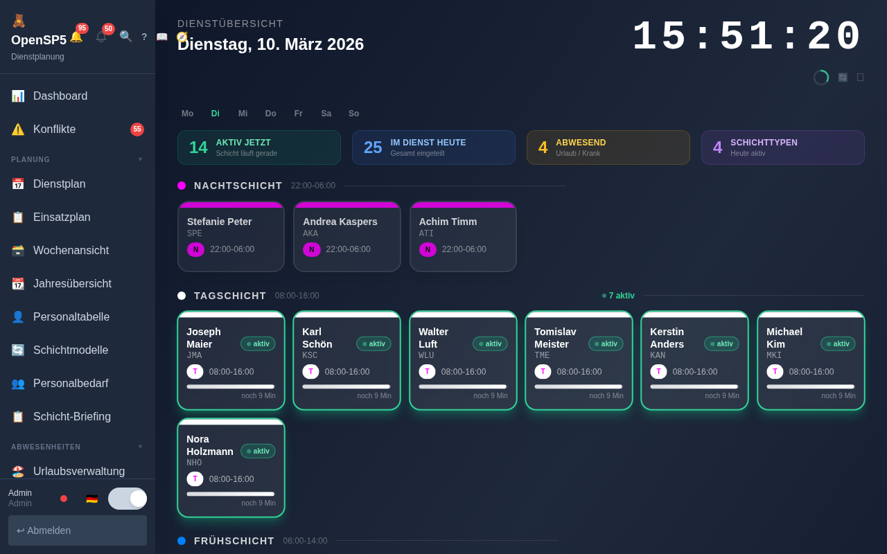

<div align="center">

# 🧸 OpenSchichtplaner5

**Open-source web replacement for Schichtplaner5**

*Reads and writes the original DBF database files directly — no migration needed.*

[](LICENSE)
[](https://python.org)
[](https://fastapi.tiangolo.com)
[](https://react.dev)
[](https://typescriptlang.org)
[](https://tailwindcss.com)
[](README.md)
[](README.md)

</div>

---

## Was ist OpenSchichtplaner5?

OpenSchichtplaner5 ist eine moderne, browserbasierte Anwendung zur Dienstplanung — entwickelt als vollwertiger Open-Source-Ersatz für die proprietäre Windows-Software **Schichtplaner5**.

Das Besondere: OpenSchichtplaner5 liest und schreibt die **originalen `.DBF`-Datenbankdateien** direkt im FoxPro-Format. Es ist keine Datenmigration nötig — beide Programme können gleichzeitig auf denselben Daten laufen.

---

## Screenshots

<table>
  <tr>
    <td><br/><sub><b>Dashboard mit Live-Charts & Widgets</b></sub></td>
    <td><br/><sub><b>Dienstplan mit Wochenend-Hervorhebung & Feiertagen</b></sub></td>
  </tr>
  <tr>
    <td><br/><sub><b>Statistiken</b></sub></td>
    <td><br/><sub><b>Jahresübersicht — Einzelansicht</b></sub></td>
  </tr>
  <tr>
    <td><br/><sub><b>Zeitkonto mit Monatsdetails</b></sub></td>
    <td><br/><sub><b>Überstunden-Übersicht</b></sub></td>
  </tr>
  <tr>
    <td><br/><sub><b>Mitarbeiterverwaltung mit Sortierung</b></sub></td>
    <td><br/><sub><b>Urlaubsverwaltung</b></sub></td>
  </tr>
  <tr>
    <td><br/><sub><b>Berichte & Reports</b></sub></td>
    <td><br/><sub><b>Aktivitätsprotokoll</b></sub></td>
  </tr>
  <tr>
    <td><br/><sub><b>📺 Leitwand — TV-Modus / Ops-Dashboard</b></sub></td>
    <td></td>
  </tr>
</table>

---

## Features

### 📅 Planung
- ✅ **Notfall-Plan** 🚨 — Kurzfristige Ausfallplanung: Schicht und Datum wählen, kranken MA markieren & aus Plan entfernen, intelligente Einspringer-Vorschläge nach Score (Verfügbarkeit, Auslastung, Beschäftigungsgrad), Ein-Klick-Zuweisung
- ✅ **Leitwand** 📺 — TV-Modus / Ops-Dashboard: Echtzeit-Uhr, Mitarbeiterkarten pro Schichtgruppe mit Fortschrittsbalken, Aktiv-Badges, Abwesenheiten, Ticker-Leiste, Vollbild-Button — optimiert für Wanddisplays im Aufenthaltsraum
- ✅ **Wochenansicht** 🗃️ — Kompakte Mo–So Tabellenübersicht aller Mitarbeiter: farbige Schicht-Badges, Wochen-Navigation, Gruppenfilter, Suche, Kompaktmodus, Heute-Hervorhebung, Legende
- ✅ **Dienstplan** — Monatsansicht mit Wochenend-Hervorhebung 🟦, heutiger Tag blau, Feiertage, Tooltips; A-Z Schnellfilter; Mitarbeiter-Auslastungsbalken; Schichtfarben-Legende; Schicht-Tausch Modal; Woche-Kopieren Modal; Schicht-Empfehlungen Modal
- ✅ **Einsatzplan** — Tages- und Wochenansicht mit Abweichungen
- ✅ **Jahresübersicht** — Einzelansicht als Standard (wie Original SP5), 12 Monate auf einen Blick mit farbigen Schicht-Badges
- ✅ **Geburtstags-Kalender** 🎂 — Alle Mitarbeitergeburtstage nach Monat gruppiert, Kalender- und Listenansicht
- ✅ **Personaltabelle** — Kompakte tabellarische Planansicht
- ✅ **Statistiken** — Soll/Ist-Vergleich, Fehlzeiten pro Gruppe/Monat
- ✅ **Jahresrückblick** 🏆 — Jahres-Auswertung über alle 12 Monate: Monats-Balkendiagramme (Stunden, Urlaub, Krank, Abwesenheiten), Mitarbeiter-Heatmap, Top-Ranking und Jahrestotals
- ✅ **Urlaubsverwaltung** — Anspruch, Saldo, Sperrtage, Genehmigungs-Workflow, PDF-Druck; **Jahres-Timeline Tab** (Gantt-Ansicht)
- ✅ **Urlaubs-Timeline** 📊 — Eigenständige Gantt-Jahresübersicht aller Abwesenheiten mit Überschneidungs-Heatmap, Gruppenfilter, Tooltip und Statistik-Kacheln
- ✅ **Schichtwünsche & Sperrtage** 💬 — Mitarbeiterwünsche und gesperrte Tage in Kalender- und Listenansicht eintragen
- ✅ **Schicht-Tauschbörse** 🔄 — Strukturierter Tausch-Workflow: Anfrage stellen, Planer genehmigt/lehnt ab, Tausch wird automatisch ausgeführt
- ✅ **Onboarding-Wizard** 🧭 — Geführter 4-Schritte-Flow zum Anlegen neuer Mitarbeiter: Persönliche Daten → Arbeitszeitmodell → Gruppen → Zusammenfassung
- ✅ **Audit-Log** 🔍 — Vollständige Änderungshistorie: wer hat wann was geändert — mit Filter, Suche und Auto-Refresh
- ✅ **Schichtmodelle** — Wiederkehrende Schichtmuster (Wochen-/Tagesrhythmus) definieren & zuordnen
- ✅ **Personalbedarf** — Mindest- und Maximalbesetzung pro Schicht/Tag; datumsspezifische Sonderbedarfe
- ✅ **Jahresabschluss** — Automatische Übertrag-Berechnung und -Buchung
- ✅ **Zeitkonto** — Soll/Ist/Saldo-Übersicht mit Monatsdetail-Modal und Jahresabschluss
- ✅ **Überstunden** — Dedizierte Überstunden-Seite: Soll/Ist/Differenz-Tabelle mit Balken-Visualisierung, Jahr- und Gruppenfilter
- ✅ **Kontobuchungen** — Manuelle Buchungen auf Zeitkonten
- ✅ **Notizen** — Tages- und mitarbeiterbezogene Notizen

### 📊 Dashboard
- ✅ **Live-Charts** — Recharts-basierte Diagramme: Soll/Ist-Balken, Abwesenheits-Kreisdiagramm
- ✅ **Morning-Briefing Widget** 🌅 — Tageszeit-abhängige Begrüßung mit Dienststatus und Schnellüberblick
- ✅ **Burnout-Radar Widget** 🔥 — Erkennt Überlastungsrisiken (lange Serien, hohe Überstunden, Wochenend-Häufung)
- ✅ **Widget: Geburtstage** — Wer hat diese Woche Geburtstag?
- ✅ **Widget: Feiertage** — Nächste Feiertage im Überblick
- ✅ **Widget: Abwesenheiten** — Wer ist heute/diese Woche abwesend?
- ✅ **Widget: Heute im Dienst** — Welche Mitarbeiter arbeiten heute?
- ✅ **Besetzungs-Heatmap** — Kalender-Heatmap mit Farbkodierung des Besetzungsgrades
- ✅ **Staffing-Warnungen** — Unterbesetzungs-Warnungen für die nächsten 7 Tage

### 👥 Stammdaten
- ✅ **Mitarbeiter** — Vollständige Stammdatenverwaltung (Stamm-, Kontakt-, Kalkulationsdaten), Foto-Upload, Schichteinschränkungen; klickbare Sortier-Spaltenköpfe; **SHORTNAME wird automatisch generiert** wenn leer
- ✅ **Gruppen** — Hierarchische Abteilungsstruktur mit Suchfeld + Sortierung
- ✅ **Schichtarten** — Zeiten, Farben, Kürzel, wochentags-spezifische Schichtzeiten
- ✅ **Abwesenheitsarten** — Urlaub, Krank, Fortbildung, Sonderurlaub …
- ✅ **Feiertage** — Jahresbezogene Feiertagsverwaltung mit Import
- ✅ **Arbeitsstätten** — Standorte & Mitarbeiterzuordnung
- ✅ **Zeitzuschläge** — Lohnzuschläge inkl. wochentags-spezifischer Konfiguration
- ✅ **Schichteinschränkungen** — Verbotene Schichten pro Mitarbeiter

### ⚖️ Fairness & Auswertung
- ✅ **Mitarbeiter-Vergleich** ⚖️ — Zwei Mitarbeiter im Jahresüberblick nebeneinander: Statistik-Balkendiagramme, Schichtarten-Verteilung, Monatsansicht
- ✅ **Fairness-Score** — Bewertet Gleichverteilung von Wochenend-, Nacht- und Feiertagsschichten mit Mitarbeiter-Ranking und Abweichungsanzeige
- ✅ **Kapazitäts-Forecast** 📊 — Monatliche Kapazitätsvorschau: Besetzungskalender (grün/gelb/rot), Urlaubskonflikt-Erkennung (>30% Team abwesend), Handlungsbedarf-Panel, Tages-Detail-Modal

### 📄 Berichte & Export (20+ Berichtstypen)
- ✅ **Dienstplan-Bericht** — Monats-/Jahresbericht (CSV, HTML)
- ✅ **Mitarbeiterliste** — Vollständige Stammdaten (CSV, Druckansicht)
- ✅ **Abwesenheitsbericht** — Gesamt, pro Typ, pro Mitarbeiter, Timeline
- ✅ **Urlaubsbericht** — Saldo, Entitlement, Gruppenübersicht
- ✅ **Schichtbericht** — Schichtenverteilung, pro Mitarbeiter, pro Gruppe
- ✅ **Zeitkonto-Bericht** — Saldo-Übersicht, Monatsdetail, Jahresabschluss-Vorschau
- ✅ **Überstunden-Bericht** — Soll/Ist/Delta pro Mitarbeiter
- ✅ **Personalbedarf-Bericht** — Soll/Ist Besetzung pro Tag

### ⬆️ Import (7 Importtypen)
- ✅ **Mitarbeiter-Import** (CSV)
- ✅ **Schichtarten-Import** (CSV)
- ✅ **Abwesenheiten-Import** (CSV)
- ✅ **Feiertage-Import** (CSV)
- ✅ **Ist-Stunden-Import** (CSV)
- ✅ **Soll-Stunden-Import** (CSV)
- ✅ **Urlaubsanspruch-Import** (CSV)
- ✅ **Gruppen-Import** (CSV)

### 🖨️ Drucken
- ✅ **Drucken-Button auf allen 22 Seiten** — jede Seite kann direkt gedruckt werden
- ✅ **Sauberes Print-CSS** — Sidebar, Buttons und nicht druckbare Elemente werden ausgeblendet
- ✅ **Druckoptimiert** — Tabellen brechen korrekt um, Farben werden für S/W-Druck optimiert

### ⌨️ UX & Bedienung
- ✅ **Keyboard Shortcuts** — Globale Tastaturkürzel für Schnellnavigation; `?` öffnet Hilfe-Overlay
- ✅ **Erweiterte Filter** — Gruppenfilter in der Mitarbeiterliste; Volltextsuche im Protokoll
- ✅ **Toast-Benachrichtigungen** — Nicht-blockierende Erfolgs-/Fehler-/Info-Meldungen

### 📱 Mobile & Performance
- ✅ **Mobile-freundlich** — Responsive Design mit Hamburger-Menü und Touch-Targets
- ✅ **Responsive Tabellen** — Horizontales Scrollen auf kleinen Bildschirmen; vergrößerte Touch-Targets
- ✅ **Code-Splitting** — Lazy Loading aller Seiten (schnellerer Start)
- ✅ **API-Cache** — Stammdaten werden gecacht; weniger Serverlast, schnellere Navigation
- ✅ **Error Handling & Retry** — Automatische Wiederholungsversuche bei API-Fehlern; `useApiData`-Hook mit Loading/Error-States
- ✅ **Optimierter Build** — Vite-basierter Production-Build

### 🔒 Sicherheit
- ✅ **Security Headers** — HTTP Security Headers (CSP, X-Frame-Options, HSTS u. a.) aktiv
- ✅ **Auth-Absicherung** — Alle Frontend-Komponenten senden korrekte Bearer-Token; keine ungescützten Endpunkte
- ✅ **Dev-Mode-Schutz** — Dev-Token nur im Entwicklungsmodus aktiv (`SP5_DEV_MODE=true`)

### 🔧 System & Administration
- ✅ **Aktivitätsprotokoll** — Vollständige Änderungshistorie aller API-Aktionen (Erstellt/Geändert/Gelöscht) mit Filtern nach Datum, Benutzer, Aktion, Objekt
- ✅ **Benutzerverwaltung** — Rollen, Passwort-Änderung, gruppen- und mitarbeiterbezogene Zugriffsrechte
- ✅ **Backup & Restore** — ZIP-Backup aller DBF-Dateien inkl. Wiederherstellung
- ✅ **Abrechnungszeiträume** — Perioden definieren und verwalten
- ✅ **Einstellungen** — Systemkonfiguration (USETT)
- ✅ **DB-Komprimierung** — Gelöschte Datensätze aus DBF-Dateien entfernen

---

## Kompatibilität

| Eigenschaft | Original SP5 | OpenSchichtplaner5 |
|-------------|:-----------:|:-----------------:|
| Betriebssystem | Windows only | 🌐 Plattformunabhängig |
| Oberfläche | Desktop-App | 🖥️ Moderner Browser |
| Datenbankformat | DBF/FoxPro | ✅ DBF/FoxPro (kompatibel) |
| Parallelbetrieb | — | ✅ Beide laufen gleichzeitig |
| Lizenz | Proprietär | ✅ Open Source (MIT) |
| Kosten | Kostenpflichtig | ✅ Kostenlos |
| Drucken | Desktop-Druck | ✅ Browser-Druck (alle Seiten) |
| Mobile | Nein | ✅ Responsive + Hamburger-Menü |

> 💡 OpenSchichtplaner5 und das Original Schichtplaner5 greifen auf **dieselben Datenbankdateien** zu. Kein Export, kein Import, keine Migration.

---

## Installation

### Voraussetzungen

- Python 3.8+
- Node.js 18+
- Zugriff auf den SP5-Datenordner (`.DBF`-Dateien)

### Backend starten

```bash
cd backend
pip install -r requirements.txt
SP5_DB_PATH=/pfad/zu/sp5/Daten uvicorn api.main:app --host 0.0.0.0 --port 8000
```

> ⚠️ **Multi-Worker Hinweis:** Die Session-Verwaltung nutzt einen In-Memory-Store.
> Bei mehreren Uvicorn-Workers (`--workers N`) werden Tokens nicht zwischen Workers geteilt,
> was zu zufälligen 401-Fehlern führt. **Verwende `--workers 1`** oder ersetze den Store
> durch eine Redis-Lösung für Multi-Worker-Deployments.

### Frontend starten

```bash
cd frontend
npm install
npm run dev
```

Öffne dann [`http://localhost:5173`](http://localhost:5173) im Browser.

### 🐳 Quick Start mit Docker

```bash
git clone https://github.com/your-org/openschichtplaner5.git
cd openschichtplaner5

# .env anpassen (SP5_DB_PATH zeigt auf vorhandene DBF-Dateien)
cp backend/.env.example backend/.env
# nano backend/.env  ← SP5_DB_PATH setzen!

docker-compose up
```

Öffne dann [`http://localhost:8000`](http://localhost:8000) im Browser.

### Konfiguration (.env)

```env
# backend/.env
SP5_DB_PATH=/pfad/zu/sp5_db/Daten    # Pflicht: Pfad zu den DBF-Dateien
ALLOWED_ORIGINS=http://localhost:5173  # CORS Origins (kommagetrennt)
DEBUG=false
```

### Hintergrundbetrieb (Linux)

```bash
# Backend
nohup sh -c 'SP5_DB_PATH=/pfad/zu/Daten uvicorn api.main:app --host 0.0.0.0 --port 8000' \
  > /tmp/sp5-backend.log 2>&1 &

# Frontend (Produktion)
cd frontend && npm run build
nohup npx serve dist -p 5173 > /tmp/sp5-frontend.log 2>&1 &
```

---

## Benutzerrollen

| Rolle | Rechte |
|-------|--------|
| **Admin** | Vollzugriff: alle Stammdaten, Benutzerverwaltung, Backup, Import, Einstellungen |
| **Planer** | Dienstplanung (Schedule, Abwesenheiten, Notizen, Übergaben, Wünsche) + Leserechte auf alle Stammdaten |
| **Leser** | Nur Lesezugriff — alle Schreiboperationen sind gesperrt (403) |

Die Rollen werden sowohl im Backend (API-Ebene, HTTP 403) als auch im Frontend (Buttons ausgeblendet) durchgesetzt.

### 🧪 Test-User für Demo

| Benutzer | Passwort | Rolle |
|----------|----------|-------|
| `admin` | `Test1234` | Admin |
| `planer` | `Test1234` | Planer |
| `leser` | `Test1234` | Leser |

---

## Projektstruktur

```
openschichtplaner5/
├── backend/
│   ├── api/
│   │   └── main.py          # FastAPI REST API (80+ Endpunkte)
│   ├── data/
│   │   └── changelog.json   # Aktivitätsprotokoll
│   └── sp5lib/
│       ├── dbf_reader.py    # DBF/FoxPro Reader (UTF-16 LE)
│       ├── dbf_writer.py    # DBF Writer (append/update/delete)
│       ├── database.py      # High-level DB access (40+ Methoden)
│       └── color_utils.py   # BGR→RGB Farbkonvertierung
├── frontend/
│   └── src/
│       ├── App.tsx           # Navigation & Layout (33 Seiten, Lazy Loading)
│       ├── api/client.ts     # Typisierter API-Client
│       └── pages/            # Alle Seitenkomponenten (33 Seiten)
└── docs/
    └── screenshots/          # App-Screenshots (33 Seiten)
```

---

## Tech Stack

| Bereich | Technologie |
|---------|-------------|
| Backend | Python, FastAPI, Uvicorn |
| Datenbank | DBF/FoxPro (direkt, kein ORM) |
| Frontend | React 18, TypeScript, Vite |
| Styling | Tailwind CSS |
| Charts | Recharts |
| API | REST (OpenAPI / Swagger unter `/docs`) |

---

## Dokumentation

📖 **[GitHub Wiki](https://github.com/mschabhuettl/openschichtplaner5/wiki)** — vollständige Dokumentation orientiert am Original-Schichtplaner5-Handbuch

---

## CHANGELOG

### [Unreleased] — TASK-01 bis TASK-19 (2026-02-22)

#### 🔧 TASK-01 — Bug-Scan & Fixes
- Fix: WORKDAYS_LIST korrekte Wochentags-Auflösung
- Fix: SHORTNAME-Kürzel-Generierung bei leeren Feldern
- Fix: API-Defaults für fehlende Pflichtfelder

#### 📊 TASK-02 — Dashboard mit echten Charts
- **Recharts-Integration:** Soll/Ist-Balkendiagramm, Abwesenheits-Kreisdiagramm
- **Widget: Geburtstage** — Mitarbeiter mit Geburtstag diesen Monat
- **Widget: Feiertage** — Nächste österreichische Feiertage
- **Widget: Abwesenheiten** — Aktuelle Abwesenheitsübersicht
- **Widget: Heute im Dienst** — Wer arbeitet heute?

#### ⚡ TASK-03 — Code-Splitting + Lazy Loading
- Alle 33 Seiten via `React.lazy()` + `Suspense` aufgeteilt
- Deutlich schnellerer initialer Seitenload
- Ladeindikator während Chunk-Download

#### 📱 TASK-04 — Mobile UX
- **Hamburger-Menü** für Smartphone & Tablet
- **Touch-Targets** vergrößert (min. 44×44px)
- Overlay-Navigation auf kleinen Bildschirmen
- Responsive Layouts für alle 33 Seiten

#### 📆 TASK-04b — Jahresübersicht Einzelansicht
- Jahresübersicht zeigt jetzt standardmäßig **Einzelansicht** (wie Original SP5)
- Umschalter zw. Einzel- und Gruppenansicht

#### 📅 TASK-05 — Dienstplan-UX
- **Wochenend-Hervorhebung** — Sa/So visuell abgehoben (hellblau)
- **Heutiger Tag** — blau hervorgehoben
- **Feiertage** im Dienstplan sichtbar (Tooltip mit Feiertagsname)
- **Tooltips** auf Schichtzellen: Schichtname, Zeiten, Abwesenheitsgrund

#### 👤 TASK-06 — SHORTNAME Auto-Generierung
- SHORTNAME wird automatisch aus Vor- und Nachnamen generiert wenn leer
- Format: erste Buchstaben Vorname + Nachname (z.B. „Max Mustermann" → „MMU")
- Kein leerer SHORTNAME mehr möglich

#### 🖨️ TASK-07 — Drucken auf allen Seiten
- **Drucken-Button** auf allen 22 Frontend-Seiten
- **Print-CSS** blendet Sidebar, Buttons und UI-Elemente aus
- Saubere Druckansicht für Tabellen, Kalender, Listen
- Funktioniert mit Browser-Druckdialog (Strg+P)

#### 🔒 TASK-08 — TypeScript Strict Mode + Code-Qualität
- `strict: true` in `tsconfig.app.json` + `tsconfig.node.json` (war bereits gesetzt, validiert)
- 4x `(import.meta as any).env` → `import.meta.env` (unnötige Casts entfernt)
- 4x `catch (err: any)` → `catch (err: unknown)` mit `instanceof Error` Typwächter
- Build: 0 Fehler, 0 TypeScript-Errors

#### 🔐 TASK-09 — Auth-System (Login, Rollen, Dev-Mode)
- **Backend-Auth:** Session-Persistenz + granulare Benutzerrechte (Admin/Planer/Leser)
- **Frontend-Login:** Login-Seite mit Benutzername/Passwort + Dev-Mode (kein Passwort)
- **Rollen-System:** Admin (voller Zugriff), Planer (Lesen/Schreiben), Leser (nur Lesen)
- **Session-Management:** Cookie-basierte Sessions, automatischer Redirect zum Login
- **Benutzerverwaltung-Seite:** Benutzer anlegen, Passwort ändern, Rollen zuweisen

#### ✏️ TASK-11 — Dienstplan bearbeiten (Write-API + Click-to-Edit)
- **Click-to-Edit:** Klick auf Zelle öffnet Modal → Schichtart auswählen → Speichern/Löschen
- **Undo/Redo:** Strg+Z / Strg+Y für unbegrenzte Rückgängig-Aktionen
- **Copy/Paste:** Schichten kopieren und einfügen
- **Backend Write-API:** `POST /api/schedule`, `DELETE /api/schedule` direkt in DBF
- **Abwesenheiten:** Abwesenheitsarten-Auswahl im Edit-Modal
- **Sonderdienst:** Schicht mit individuellen Start/Endzeiten

#### 📈 TASK-12 — Mitarbeiter-Stundenauswertung mit CSV-Export
- **Neuer Tab "Mitarbeiter-Auswertung"** in der Statistiken-Seite
- **Mitarbeiter-Dropdown** mit Namen + Kürzel
- **8 Summary-Cards:** Soll-Std, Ist-Std, Differenz, Schichten, Wochenende, Nachtschichten, Urlaubstage, Abwesenheit
- **Monatstabelle:** 12 Monate als Jahresübersicht pro Person
- **CSV-Export:** Download der persönlichen Stundenübersicht (Excel-kompatibel mit BOM)
- **Backend:** Neuer Endpoint `GET /api/statistics/employee/{id}?year=&month=`

#### ⚡ TASK-13 — Bulk-Schichtzuweisung (Wochenvorlagen)
- **Shift gedrückt + mehrere Zellen auswählen** → Massenzuweisung einer Schicht
- **Drag & Drop:** Schichten per Drag & Drop verschieben (Alt = Kopieren)
- **Backend:** `POST /api/schedule/bulk` für Zeiträume
- **Rechtsklick-Menü:** Kontextmenü mit Woche/Monat füllen

#### 👥 TASK-15 — Mitarbeiter vollständige CRUD-UI
- **„+ Neu" Button:** Neuen Mitarbeiter direkt in der Web-UI anlegen
- **Edit-Modal:** Alle Stammdaten bearbeiten (Name, Kürzel, Stunden, Wochentage, Farben, Foto)
- **Soft-Delete:** Mitarbeiter deaktivieren (nicht dauerhaft löschen)
- **Sortierbare Spalten:** Alle Tabellenköpfe klickbar für Auf-/Absteigend-Sortierung

#### ⚠️ TASK-16 — Konflikte-Bereinigungstool
- **Neue Seite „Konflikte"** mit Badge-Zähler im Menü
- **Tabelle:** Mitarbeiter | Datum | Schicht | Abwesenheit | Aktionen
- **Aktionen:** [Schicht löschen] + [Abwesenheit löschen] direkt aus der Übersicht
- **Konflikt-Banner im Dienstplan** mit Inline-Löschbuttons pro Konflikt
- **Backend:** `DELETE /api/schedule-shift/{emp_id}/{date}` + `DELETE /api/absences/{emp_id}/{date}`

#### ⌨️ TASK-17 — Keyboard Power-Mode (Dienstplan per Tastatur)
- **Pfeiltasten:** Navigation durch alle Zellen (Mitarbeiter × Tag)
- **Buchstaben-Shortcuts:** Kürzel-Eingabe → direkte Schichtzuweisung (z.B. `F` = Frühschicht)
- **Del/Backspace:** Schicht löschen
- **Enter:** Ausgewählte Zelle öffnen (wie Klick)
- **Escape:** Selektion aufheben / Modal schließen
- **Visueller Fokus-Indikator:** Blaue Border auf aktiver Zelle
- **Shortcut-Cheatsheet:** Hilfe-Overlay mit `?`-Button

#### 🚦 TASK-18 — Personalbedarf-Ampel (Live-Besetzungs-Feedback)
- **Ampel-Punkt** je Spaltenheader im Dienstplan: 🟢 ok / 🟡 knapp / 🔴 zu wenig
- **Tooltip:** "3/4 Mitarbeiter besetzt"
- **Backend:** Neuer Endpoint `GET /api/schedule/coverage?year=&month=`
- **Dashboard-Integration:** Besetzungsampel auch im Dashboard-Widget sichtbar

#### 🤖 TASK-19 — Auto-Planer (Schichtplan aus Schichtmodellen)
- **„🤖 Auto-Planen" Button** im Dienstplan-Header
- **2-Schritt-Dialog:** Konfiguration → Preview (was würde generiert?)
- **Preview-Schritt:** Zeigt neue/übersprungene Einträge BEVOR die Generierung läuft
- **Optionen:** Monat wählen, Mitarbeiter-Filter, Bestehende-Einträge-Handling
- **Backend:** `POST /api/schedule/generate` nutzt `generate_schedule_from_cycle()` aus sp5lib
- **Warnung:** Bei `force=true` wird Hinweis angezeigt (überschreibt bestehende Einträge)

---

### 2026-02-22 (d213eb4)
#### Neu
- 14 neue Report-Typen (Schichtbericht, Zeitkonto-Bericht, Personalbedarf, Abwesenheits-Timeline, …)
- 6 neue Import-Typen (Ist-Stunden, Soll-Stunden, Urlaubsanspruch, Abwesenheiten, Gruppen, Feiertage)
- Berichte-Seite komplett überarbeitet

### 2026-02-21 (2f36238)
#### Neu
- Wochentags-spezifische Schichtzeiten (Montag bis Sonntag unterschiedlich)
- Foto-Upload für Mitarbeiter
- Urlaubsantrag-Druckansicht
- Passwort-Ändern in Benutzerverwaltung
- Anonyme/verdeckte Abwesenheiten

### 2026-02-20 (bf18a0f)
#### Neu
- Feiertage-Import (CSV)
- Maximalbedarf (MAX) in Personalbedarf-Planung
- Saldo-Übertrag (Jahresabschluss → nächstes Jahr buchen)

---

## Lizenz

MIT © [mschabhuettl](https://github.com/mschabhuettl)
