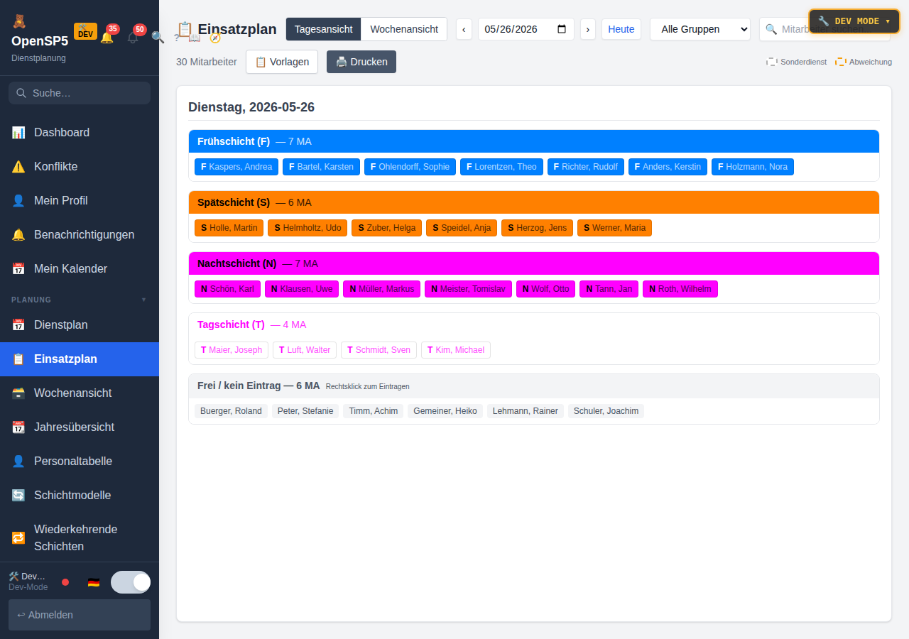
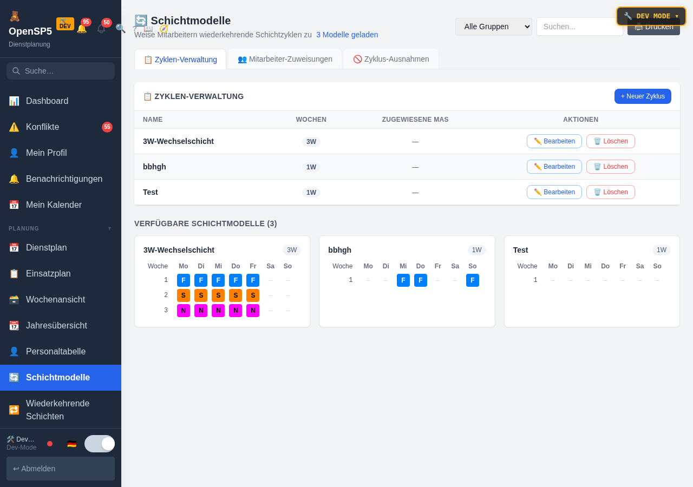
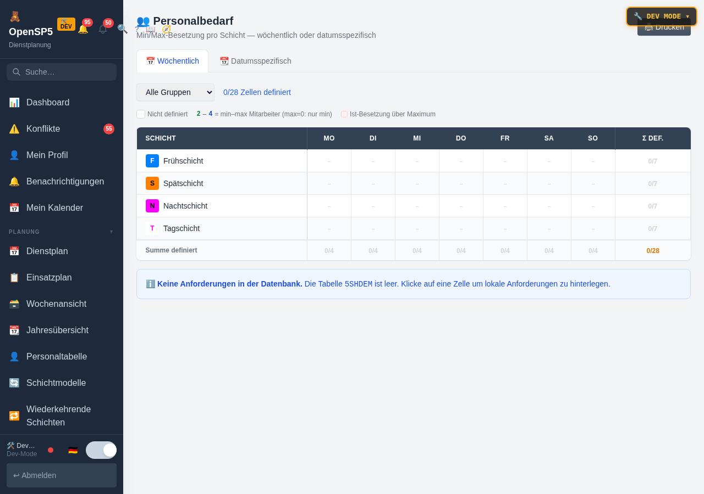
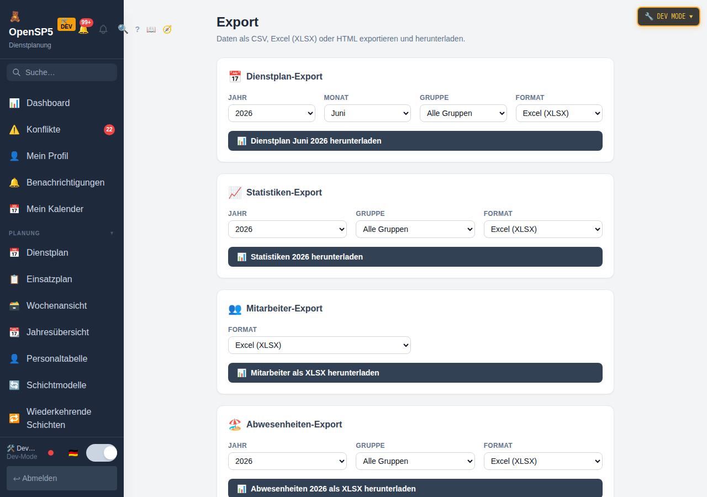
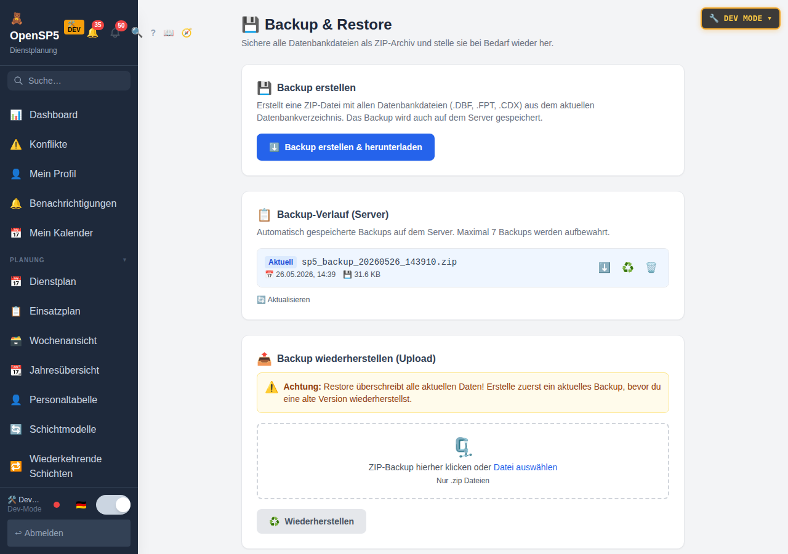

# OpenSchichtplaner5

[](LICENSE)
[](https://www.python.org/)
[](https://fastapi.tiangolo.com/)
[](https://react.dev/)
[](https://www.typescriptlang.org/)

---

**OpenSchichtplaner5 ist ein Open-Source-Ersatz für die Windows-Software Schichtplaner5.**  
Liest und schreibt die originalen DBF-Datenbankdateien direkt — keine Migration nötig.  
SP5 und OpenSchichtplaner5 können parallel auf denselben Daten laufen.

**OpenSchichtplaner5 is an open-source replacement for the Windows software Schichtplaner5.**  
It reads and writes the original DBF database files directly — no migration needed.  
SP5 and OpenSchichtplaner5 can run simultaneously on the same data.

---

## 📸 Screenshots

| Dashboard | Dienstplan | Statistiken |
|:---------:|:----------:|:-----------:|
|  |  |  |

| Mitarbeiter | Jahresübersicht | Urlaubsverwaltung |
|:-----------:|:---------------:|:-----------------:|
|  |  |  |

| Einsatzplan | Zeitkonto | Schichtmodelle |
|:-----------:|:---------:|:--------------:|
|  |  |  |

| Personalbedarf | Export | Backup |
|:--------------:|:------:|:------:|
|  |  |  |

---

## ✨ Features

- ✅ **Dienstplan** — Monatsansicht, editierbar per Rechtsklick-Kontextmenü
- ✅ **Einsatzplan** — Tages- und Wochenansicht
- ✅ **Jahresübersicht** — Mitarbeiter × 12 Monate auf einen Blick
- ✅ **Statistiken** — Soll/Ist-Stunden, Überstunden-Auswertung
- ✅ **Urlaubsverwaltung** — Anspruch, Saldo, Sperrtage, Jahresabschluss
- ✅ **Zeitkonto & Kontobuchungen** — Arbeitszeitkonten mit Buchungshistorie
- ✅ **Schichtmodelle & Personalbedarf** — Vorlagen und Bedarfsplanung
- ✅ **Stammdaten** — Mitarbeiter, Gruppen, Schichtarten, Abwesenheitsarten, Feiertage, Arbeitsstätten, Zulagen
- ✅ **Berichte & CSV-Export** — Auswertungen als Datei exportieren
- ✅ **Import & Backup/Restore** — Datensicherung und Wiederherstellung
- ✅ **Notizen & Perioden** — Kommentare und Abrechnungsperioden
- ✅ **Benutzerverwaltung** — Zugriffsrechte und Login
- ✅ **Mobile-freundliche Oberfläche** — Responsive Design mit Hamburger-Menü

---

## 🔄 Kompatibilität

OpenSchichtplaner5 liest und schreibt die originalen **Schichtplaner5 DBF-Dateien** im FoxPro-Format direkt.

- ✅ Keine Datenmigration notwendig
- ✅ SP5 (Windows) und OpenSP5 (Browser) können **gleichzeitig** auf denselben Dateien arbeiten
- ✅ Alle bestehenden Daten bleiben vollständig erhalten

---

## 🚀 Installation

### Voraussetzungen

- Python 3.10+
- Node.js 18+
- Zugriff auf das Verzeichnis mit den Schichtplaner5-Datenbankdateien (`.dbf`)

### Backend (Python / FastAPI)

```bash
cd backend
pip install -r requirements.txt

# Pfad zur SP5-Datenbank setzen und Server starten
SP5_DB_PATH=/pfad/zu/sp5-daten uvicorn api.main:app --host 0.0.0.0 --port 8000
```

Die API ist dann erreichbar unter: `http://localhost:8000`  
Swagger-Dokumentation: `http://localhost:8000/docs`

### Frontend (React / Vite)

```bash
cd frontend
npm install
npm run dev
```

Das Frontend läuft standardmäßig unter: `http://localhost:5173`

### Produktiv-Build

```bash
cd frontend
npm run build
# Statische Dateien werden in frontend/dist/ generiert
```

---

## 🛠️ Tech Stack

| Schicht | Technologie |
|---------|-------------|
| **Backend** | Python 3, FastAPI, Uvicorn |
| **Datenbank** | DBF (FoxPro-Format), via `dbfread` / `dbf` |
| **Frontend** | React 18, TypeScript, Vite |
| **Styling** | Tailwind CSS |
| **API** | REST (OpenAPI / Swagger) |

---

## 📂 Projektstruktur

```
openschichtplaner5/
├── backend/
│   ├── api/
│   │   └── main.py          # FastAPI-Anwendung
│   └── requirements.txt
├── frontend/
│   ├── src/
│   │   ├── components/      # React-Komponenten
│   │   ├── pages/           # Seiten / Views
│   │   └── main.tsx
│   ├── package.json
│   └── vite.config.ts
└── docs/
    └── screenshots/         # Screenshots für die Dokumentation
```

---

## 📄 Lizenz

Dieses Projekt steht unter der **MIT License** — siehe [LICENSE](LICENSE) für Details.

---

## 🤝 Beiträge

Pull Requests sind willkommen! Bitte öffne zuerst ein Issue, um größere Änderungen zu besprechen.

1. Fork das Repository
2. Erstelle einen Feature-Branch (`git checkout -b feature/mein-feature`)
3. Committe deine Änderungen (`git commit -m 'feat: mein neues Feature'`)
4. Pushe den Branch (`git push origin feature/mein-feature`)
5. Öffne einen Pull Request

---

> **Hinweis:** Dieses Projekt ist kein offizielles Produkt und steht in keiner Verbindung zu den Entwicklern der originalen Schichtplaner5-Software.
