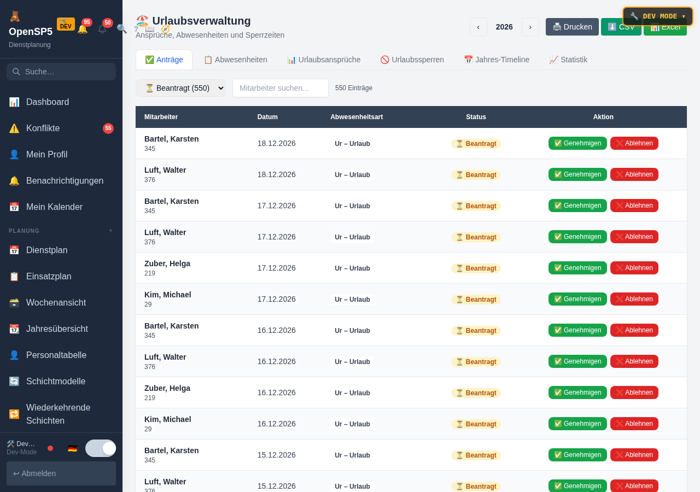

<div align="center">

# 🧸 OpenSchichtplaner5

**Open-source web replacement for Schichtplaner5**

*Reads and writes the original DBF database files directly — no migration needed.*

[](LICENSE)
[](https://python.org)
[](https://fastapi.tiangolo.com)
[](https://react.dev)
[](https://typescriptlang.org)
[](https://tailwindcss.com)

</div>

---

## Was ist OpenSchichtplaner5?

OpenSchichtplaner5 ist eine moderne, browserbasierte Anwendung zur Dienstplanung — entwickelt als vollwertiger Open-Source-Ersatz für die proprietäre Windows-Software **Schichtplaner5**.

Das Besondere: OpenSchichtplaner5 liest und schreibt die **originalen `.DBF`-Datenbankdateien** direkt im FoxPro-Format. Es ist keine Datenmigration nötig — beide Programme können gleichzeitig auf denselben Daten laufen.

---

## Screenshots

<table>
  <tr>
    <td><br/><sub><b>Dashboard</b></sub></td>
    <td><br/><sub><b>Dienstplan (Monatsansicht)</b></sub></td>
  </tr>
  <tr>
    <td><br/><sub><b>Statistiken</b></sub></td>
    <td><br/><sub><b>Jahresübersicht</b></sub></td>
  </tr>
  <tr>
    <td><br/><sub><b>Mitarbeiterverwaltung</b></sub></td>
    <td><br/><sub><b>Urlaubsverwaltung</b></sub></td>
  </tr>
</table>

---

## Features

### Planung
- ✅ **Dienstplan** — Monatsansicht, Schichten & Abwesenheiten per Rechtsklick eintragen
- ✅ **Einsatzplan** — Tages- und Wochenansicht
- ✅ **Jahresübersicht** — 12 Monate pro Mitarbeiter auf einen Blick
- ✅ **Statistiken** — Soll/Ist-Vergleich, Überstunden, Fehlzeiten
- ✅ **Urlaubsverwaltung** — Anspruch, Saldo, Sperrtage, Jahresabschluss
- ✅ **Zeitkonto & Kontobuchungen** — Arbeitszeitguthaben verwalten
- ✅ **Schichtmodelle** — Wiederkehrende Schichtmuster definieren und zuordnen
- ✅ **Personalbedarf** — Mindestbesetzung pro Schicht und Tag festlegen

### Stammdaten
- ✅ **Mitarbeiter** — Vollständige Stammdatenverwaltung mit CRUD
- ✅ **Gruppen / Abteilungen** — Mitarbeiter in Teams organisieren
- ✅ **Schichtarten** — Zeiten, Farben, Kürzel definieren
- ✅ **Abwesenheitsarten** — Urlaub, Krank, Fortbildung, Sonderurlaub …
- ✅ **Feiertage** — Jahresbezogene Feiertagsverwaltung
- ✅ **Arbeitsstätten & Zulagen** — Standorte und Lohnzuschläge

### Daten & System
- ✅ **CSV-Export** — Dienstplan, Statistiken, Mitarbeiter, Abwesenheiten
- ✅ **HTML-Export** — Druckfertiger Dienstplan
- ✅ **Import** — Massenimport via CSV
- ✅ **Backup & Restore** — ZIP-Backup aller DBF-Dateien
- ✅ **Benutzerverwaltung** — Rollen, Zugriffsrechte, Gruppeneinschränkungen
- ✅ **Mobile-freundlich** — Responsive Design mit Hamburger-Menü

---

## Kompatibilität

| Eigenschaft | Original SP5 | OpenSchichtplaner5 |
|-------------|:-----------:|:-----------------:|
| Betriebssystem | Windows only | 🌐 Plattformunabhängig |
| Oberfläche | Desktop-App | 🖥️ Moderner Browser |
| Datenbankformat | DBF/FoxPro | ✅ DBF/FoxPro (kompatibel) |
| Parallelbetrieb | — | ✅ Beide laufen gleichzeitig |
| Lizenz | Proprietär | ✅ Open Source (MIT) |
| Kosten | Kostenpflichtig | ✅ Kostenlos |

> 💡 OpenSchichtplaner5 und das Original Schichtplaner5 greifen auf **dieselben Datenbankdateien** zu. Kein Export, kein Import, keine Migration.

---

## Installation

### Voraussetzungen

- Python 3.8+
- Node.js 18+
- Zugriff auf den SP5-Datenordner (`.DBF`-Dateien)

### Backend starten

```bash
cd backend
pip install -r requirements.txt
SP5_DB_PATH=/pfad/zu/sp5/Daten uvicorn api.main:app --host 0.0.0.0 --port 8000
```

### Frontend starten

```bash
cd frontend
npm install
npm run dev
```

Öffne dann [`http://localhost:5173`](http://localhost:5173) im Browser.

### Hintergrundbetrieb (Linux)

```bash
# Backend
nohup sh -c 'SP5_DB_PATH=/pfad/zu/Daten uvicorn api.main:app --host 0.0.0.0 --port 8000' \
  > /tmp/sp5-backend.log 2>&1 &

# Frontend (Entwicklung)
nohup npm --prefix frontend run dev -- --host 0.0.0.0 --port 5173 \
  > /tmp/sp5-frontend.log 2>&1 &
```

---

## Projektstruktur

```
openschichtplaner5/
├── backend/
│   ├── api/
│   │   └── main.py          # FastAPI REST API
│   └── sp5lib/
│       ├── dbf_reader.py    # DBF/FoxPro Reader (UTF-16 LE)
│       ├── dbf_writer.py    # DBF Writer (append/update/delete)
│       ├── database.py      # High-level DB access
│       └── color_utils.py   # BGR→RGB Farbkonvertierung
├── frontend/
│   └── src/
│       ├── App.tsx           # Navigation & Layout
│       └── pages/            # Alle Seitenkomponenten
└── docs/
    └── screenshots/          # App-Screenshots
```

---

## Tech Stack

| Bereich | Technologie |
|---------|-------------|
| Backend | Python, FastAPI, Uvicorn |
| Datenbank | DBF/FoxPro (direkt, kein ORM) |
| Frontend | React 18, TypeScript, Vite |
| Styling | Tailwind CSS |
| API | REST (OpenAPI / Swagger unter `/docs`) |

---

## Dokumentation

📖 **[GitHub Wiki](https://github.com/mschabhuettl/openschichtplaner5/wiki)** — vollständige Dokumentation (29 Seiten) orientiert am Original-Schichtplaner5-Handbuch

---

## Lizenz

MIT © [mschabhuettl](https://github.com/mschabhuettl)
