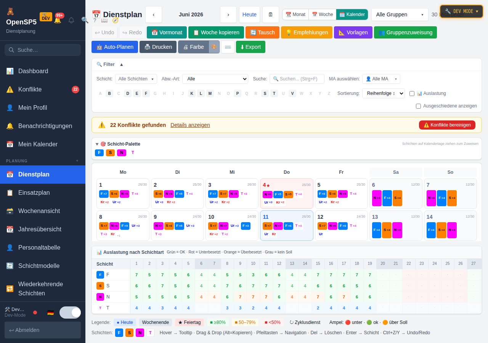
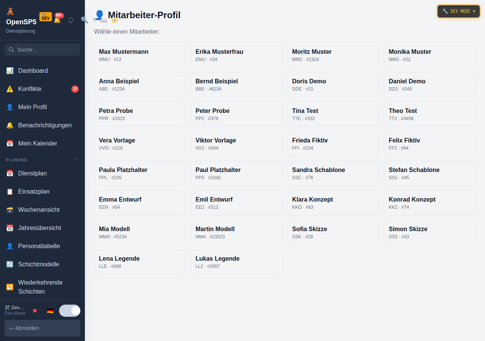
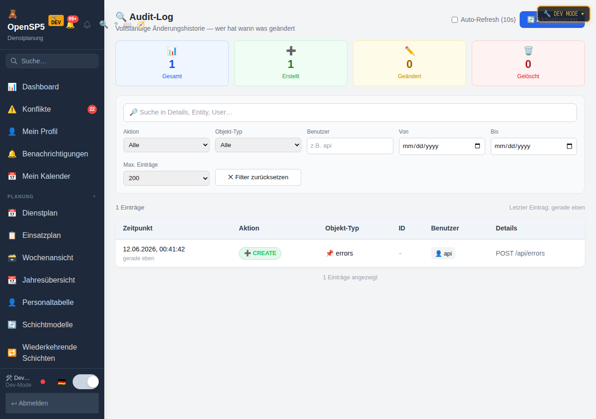
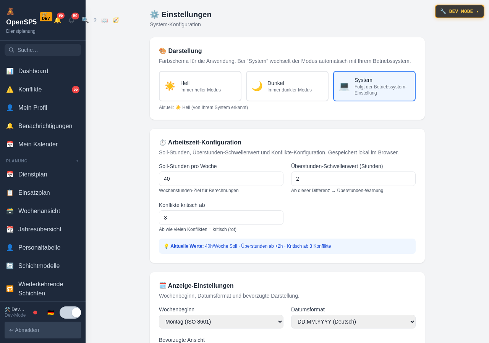
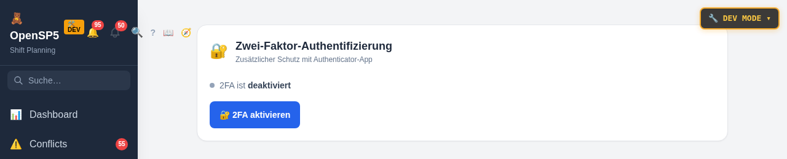
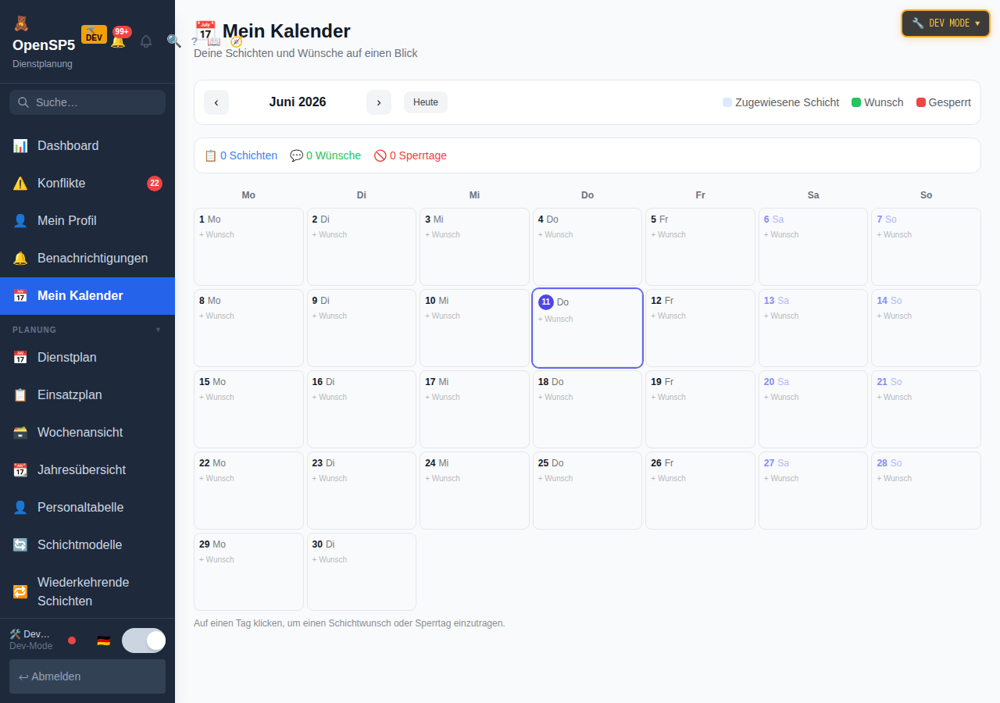

<div align="center">

# 🧸 OpenSchichtplaner5

**Open-source web replacement for Schichtplaner5**

*Reads and writes the original DBF database files directly — no migration needed.*

[](LICENSE)
[](CHANGELOG.md)
[](https://github.com/mschabhuettl/openschichtplaner5/actions/workflows/test.yml)
[](https://github.com/mschabhuettl/openschichtplaner5/actions/workflows/docker.yml)
[](https://github.com/mschabhuettl/openschichtplaner5/releases)
[](https://python.org)
[](https://fastapi.tiangolo.com)
[](https://react.dev)
[](https://typescriptlang.org)
[](https://tailwindcss.com)
[](README.md)
[](README.md)

</div>

---

## What is OpenSchichtplaner5?

OpenSchichtplaner5 is a modern, browser-based shift planning application — developed as a fully-featured open-source replacement for the proprietary Windows software **Schichtplaner5**.

The key differentiator: OpenSchichtplaner5 reads and writes the **original `.DBF` database files** directly in FoxPro format. No data migration is required — both programs can run simultaneously on the same data.

---

## Screenshots

<table>
  <tr>
    <td><br/><sub><b>Dashboard with Live Charts & Widgets</b></sub></td>
    <td><br/><sub><b>Schedule — Monthly View</b></sub></td>
  </tr>
  <tr>
    <td><br/><sub><b>📆 Calendar View (new!)</b></sub></td>
    <td><br/><sub><b>Employee Management</b></sub></td>
  </tr>
  <tr>
    <td><br/><sub><b>🪪 Employee Profile with Qualifications</b></sub></td>
    <td><br/><sub><b>Leave Management</b></sub></td>
  </tr>
  <tr>
    <td><br/><sub><b>Statistics — Target/Actual Comparison</b></sub></td>
    <td><br/><sub><b>Reports</b></sub></td>
  </tr>
  <tr>
    <td><br/><sub><b>🔍 Audit Trail / Activity Log</b></sub></td>
    <td><br/><sub><b>⚙️ Settings</b></sub></td>
  </tr>
  <tr>
    <td><br/><sub><b>🔐 Two-Factor Authentication (new!)</b></sub></td>
    <td><br/><sub><b>📅 My Calendar — Self-Service (new!)</b></sub></td>
  </tr>
  <tr>
    <td><br/><sub><b>💾 Backup & Restore (new!)</b></sub></td>
    <td><br/><sub><b>📺 Control Board — TV Mode / Ops Dashboard</b></sub></td>
  </tr>
</table>

---

## Features

| Area | Highlights |
|------|-----------|
| 📅 **Scheduling** | Weekly & monthly schedule, calendar view, drag & drop, undo/redo, templates, auto-planner, recurring shifts (🔁 UI) |
| 👥 **Employees** | Full CRUD, groups, skills, availability, contract hours, onboarding wizard + checklist, CSV bulk import, side-by-side comparison view, qualification matrix |
| 🏖️ **Leave Management** | Requests, approval workflow, annual timeline (Gantt), entitlements, year-end close, absence statistics UI (overview/group/employee tabs, CSS charts) |
| 🔄 **Self-Service** | Shift preferences, swap exchange (with notifications + auto-expiry), personal calendar, profile management |
| 📊 **Analytics** | Dashboard with live charts, statistics, year in review, burnout radar, performance widget, overtime tracking (visual bar chart), employee timeline (horizontal CSS) |
| 📄 **Reports & Export** | 20+ report types, CSV/Excel download, print stylesheets (A4 landscape, improved), iCal feed, scheduled email exports (CRUD UI), shift conflict report (CSV/XLSX) |
| ⚖️ **Work-Time Rules** | Configurable rule engine: max hours/day, minimum rest between shifts, max consecutive days — violations highlighted in schedule view |
| 🔔 **Notifications** | Real-time updates (SSE), email (SMTP), in-app notification center, swap request status notifications, per-user event toggles |
| 🔒 **Security** | Role-based access (Admin/Planner/Reader), 2FA (TOTP), bcrypt, JWT, rate limiting, audit log |
| 🔍 **Search** | Global header search across employees, groups, and shifts (`Ctrl+K`) |
| 💬 **Comments** | Day-level schedule notes with 📝 indicator and inline popover editor |
| 🔌 **API** | Versioned REST API (`/api/v1/`), OpenAPI/Swagger docs, deprecation headers for legacy routes |
| 🐳 **Operations** | Docker deployment, CI/CD, SQLite backup/restore, health dashboard, auto DB migration on updates |
| 🗄️ **Database** | SQLite/DBF (default), PostgreSQL (optional) — full feature parity, auto-migration |
| 📱 **UX** | Dark mode (system preference), mobile-responsive, keyboard navigation, drag & drop, offline indicator |

> Full feature details: [CHANGELOG.md](CHANGELOG.md) · [GitHub Wiki](https://github.com/mschabhuettl/openschichtplaner5/wiki)
---

## Compatibility

| Property | Original SP5 | OpenSchichtplaner5 |
|----------|:-----------:|:-----------------:|
| Operating System | Windows only | 🌐 Cross-platform |
| Interface | Desktop app | 🖥️ Modern browser |
| Database Format | DBF/FoxPro | ✅ DBF/FoxPro (compatible) |
| Parallel Operation | — | ✅ Both run simultaneously |
| License | Proprietary | ✅ Open Source (MIT) |
| Cost | Paid | ✅ Free |
| Printing | Desktop print | ✅ Browser print (all pages) |
| Mobile | No | ✅ Responsive + hamburger menu |

> 💡 OpenSchichtplaner5 and the original Schichtplaner5 access **the same database files**. No export, no import, no migration.

---

## Installation

### Prerequisites

- Python 3.10+ (the `libopenschichtplaner5` core requires ≥ 3.10; CI runs on 3.12)
- Node.js 20+
- Access to the SP5 data directory (`.DBF` files)

### Start the Backend

```bash
cd backend
pip install -r requirements.txt
SP5_DB_PATH=/path/to/sp5/Data SP5_BACKEND_DIR="$(pwd)" uvicorn sp5api.main:app --host 0.0.0.0 --port 8000
```

> ⚠️ **Multi-Worker Note:** Session management uses an in-memory store.
> With multiple Uvicorn workers (`--workers N`), tokens are not shared between workers,
> which leads to random 401 errors. **Use `--workers 1`** or replace the store
> with a Redis solution for multi-worker deployments.

### Start the Frontend

```bash
cd frontend
npm install
npm run dev
```

Then open [`http://localhost:5173`](http://localhost:5173) in your browser.

### 🐳 Docker Deployment

Docker images are automatically built on every release and published to the GitHub Container Registry:

```bash
# Latest release (amd64 + arm64)
docker pull ghcr.io/mschabhuettl/openschichtplaner5:latest

# Specific version
docker pull ghcr.io/mschabhuettl/openschichtplaner5:1.2.0
```

#### Quick Start with Docker Compose

```bash
git clone https://github.com/mschabhuettl/openschichtplaner5.git
cd openschichtplaner5

# Adjust configuration (SP5_DB_PATH + SECRET_KEY!)
cp .env.example .env
nano .env    # Set SP5_DB_PATH + SECRET_KEY!

# Start in production mode (detached)
make prod
# or: docker compose up -d --build
```

Then open [`http://localhost:8000`](http://localhost:8000) in your browser.

#### Makefile Commands

| Command | Description |
|---------|-------------|
| `make prod` | Start Docker container in production mode (detached) |
| `make docker` | Start Docker container (foreground) |
| `make docker-dev` | Development mode with hot-reload (`--profile dev`) |
| `make docker-down` | Stop containers |
| `make update` | `git pull` + Docker restart (rolling update) |
| `make backup` | Database volume → local `.tar.gz` archive |
| `make build` | Build frontend bundle |
| `make test` | Run frontend unit tests, vitest (backend pytest lives in the API repo) |
| `make test-e2e` | Run Playwright E2E tests (expects the app running on `:5173`) |
| `make lint` | ruff + eslint — fails on findings |
| `make logs` | Show live logs |

#### Configuration (`.env` in the repo root)

Both compose files read `env_file: .env` from the repo root. All environment
variables with explanations: → [`.env.example`](.env.example)

Most important required fields:

```env
SP5_DB_PATH=/app/data          # Path to DBF files in the container (default)
SECRET_KEY=<openssl rand -hex 32>  # JWT secret — MUST be changed!
ALLOWED_ORIGINS=https://my-domain.com  # Allow only your own domain
SP5_HSTS=true    # HTTPS-only — only enable with TLS reverse proxy!
SP5_DEV_MODE=false  # NEVER set to true in production!
```

#### Backup & Restore

```bash
# Create backup (volume → local archive in ./backups/)
make backup

# Restore (example)
docker run --rm \
  -v openschichtplaner5_sp5_data:/data \
  -v $(pwd)/backups:/backup \
  alpine tar xzf /backup/sp5_db_<timestamp>.tar.gz -C /data
```

#### Applying Updates

```bash
make update   # git pull + Docker restart in one step
```

#### Reverse Proxy (nginx/caddy)

For production environments, a reverse proxy with TLS is recommended:

```nginx
server {
    listen 443 ssl http2;
    server_name my-domain.com;

    ssl_certificate     /etc/letsencrypt/live/my-domain.com/fullchain.pem;
    ssl_certificate_key /etc/letsencrypt/live/my-domain.com/privkey.pem;
    ssl_protocols       TLSv1.2 TLSv1.3;
    ssl_ciphers         HIGH:!aNULL:!MD5;

    # ── Security Headers ─────────────────────────────────────────────────────
    add_header Strict-Transport-Security "max-age=63072000; includeSubDomains; preload" always;
    add_header X-Frame-Options           "SAMEORIGIN"                                   always;
    add_header X-Content-Type-Options    "nosniff"                                      always;
    add_header X-XSS-Protection          "1; mode=block"                                always;
    add_header Referrer-Policy           "strict-origin-when-cross-origin"              always;
    add_header Permissions-Policy        "camera=(), microphone=(), geolocation=()"     always;
    # Adjust CSP if using custom CDN/fonts:
    add_header Content-Security-Policy   "default-src 'self'; script-src 'self' 'unsafe-inline'; style-src 'self' 'unsafe-inline'; img-src 'self' data: blob:; connect-src 'self'; font-src 'self'; frame-ancestors 'none';" always;
    # ─────────────────────────────────────────────────────────────────────────

    location / {
        proxy_pass         http://127.0.0.1:8000;
        proxy_set_header   Host              $host;
        proxy_set_header   X-Real-IP         $remote_addr;
        proxy_set_header   X-Forwarded-For   $proxy_add_x_forwarded_for;
        proxy_set_header   X-Forwarded-Proto $scheme;
        proxy_read_timeout 60s;
        proxy_buffering    off;
    }

    # SSE (Server-Sent Events) requires no buffering
    location /api/v1/events {
        proxy_pass         http://127.0.0.1:8000;
        proxy_set_header   Host              $host;
        proxy_set_header   X-Forwarded-Proto $scheme;
        proxy_read_timeout 3600s;
        proxy_buffering    off;
        proxy_cache        off;
        chunked_transfer_encoding on;
    }
}

# HTTP → HTTPS redirect
server {
    listen 80;
    server_name my-domain.com;
    return 301 https://$host$request_uri;
}
```

With a reverse proxy, set `SP5_HSTS=true`.

#### Recommended Server Setup

```bash
# 1. Create .env from template and adjust
cp .env.example .env
nano .env   # Set SECRET_KEY, SP5_DB_PATH, ALLOWED_ORIGINS

# 2. Start with explicit prod compose (binds only to localhost)
make prod-secure
# or directly:
docker compose -f docker-compose.prod.yml up -d --build

# 3. Put nginx as reverse proxy in front (see configuration above)
```

#### Production Readiness Checklist

- [ ] `SECRET_KEY` set to secure random value (`openssl rand -hex 32`)
- [ ] `DEBUG=false`
- [ ] `SP5_DEV_MODE=false`
- [ ] `ALLOWED_ORIGINS` restricted to own domain
- [ ] `SP5_HSTS=true` (only with HTTPS/reverse proxy)
- [ ] Nginx security headers set (X-Frame-Options, CSP, HSTS, …)
- [ ] Port 8000 bound only to `127.0.0.1` (via `docker-compose.prod.yml`)
- [ ] Regular backups via `make backup` or cron configured
- [ ] Logs under `./logs/` monitored

#### Local Operation without Docker

```bash
bash start.sh          # Normal start (backend + frontend)
bash start.sh --build  # With forced frontend rebuild
bash start.sh --stop   # Stop backend
```

---

## User Roles

| Role | Permissions |
|------|-------------|
| **Admin** | Full access: all master data, user management, backup, import, settings |
| **Planner** | Shift planning (schedule, absences, notes, handovers, preferences) + read access to all master data |
| **Reader** | Read-only access — all write operations are blocked (403) |

Roles are enforced both in the backend (API level, HTTP 403) and in the frontend (buttons hidden).

### 🧪 Test Users for Demo

| User | Password | Role |
|------|----------|------|
| `admin` | `Test1234` | Admin |
| `planer` | `Test1234` | Planner |
| `leser` | `Test1234` | Reader |

---

## Project Structure

```
openschichtplaner5/
├── backend/
│   ├── api/                 # Runtime state (api/data, api/uploads) — the API
│   │                        # CODE is the external openschichtplaner5-api
│   │                        # package (import name: sp5api). See:
│   │                        # https://github.com/mschabhuettl/openschichtplaner5-api
│   ├── data/
│   │   └── changelog.json   # Activity log
│   └── fixtures/            # DBF fixture data (e2e seed)
│   # DBF reader/writer + high-level DB access live in the libopenschichtplaner5
│   # package (import name: sp5lib), pulled in as a dependency. See:
│   # https://github.com/mschabhuettl/libopenschichtplaner5
├── frontend/
│   └── src/
│       ├── App.tsx           # Navigation & Layout (77 pages, lazy loading)
│       ├── api/client.ts     # Typed API client
│       └── pages/            # All page components (77 pages)
└── docs/
    └── screenshots/          # App screenshots
```

---

## Tech Stack

| Area | Technology |
|------|------------|
| Backend | Python, FastAPI, Uvicorn |
| Database | DBF/FoxPro (direct, no ORM) |
| Frontend | React 19, TypeScript, Vite |
| Styling | Tailwind CSS |
| Charts | Recharts |
| API | REST (OpenAPI / Swagger at `/api/v1/docs`) — 162+ endpoints fully documented |
| Email | SMTP (optional) — notifications, password reset |
| Calendar | iCal feed (`.ics`) — token-based schedule subscription |
| Real-time | SSE (Server-Sent Events) — live updates without polling |
| Testing | vitest (frontend) + Playwright (E2E); backend pytest lives in the [API repo](https://github.com/mschabhuettl/openschichtplaner5-api) |

---

## Documentation

📖 **[GitHub Wiki](https://github.com/mschabhuettl/openschichtplaner5/wiki)** — full documentation based on the original Schichtplaner5 manual

---

## License

MIT © [mschabhuettl](https://github.com/mschabhuettl)
