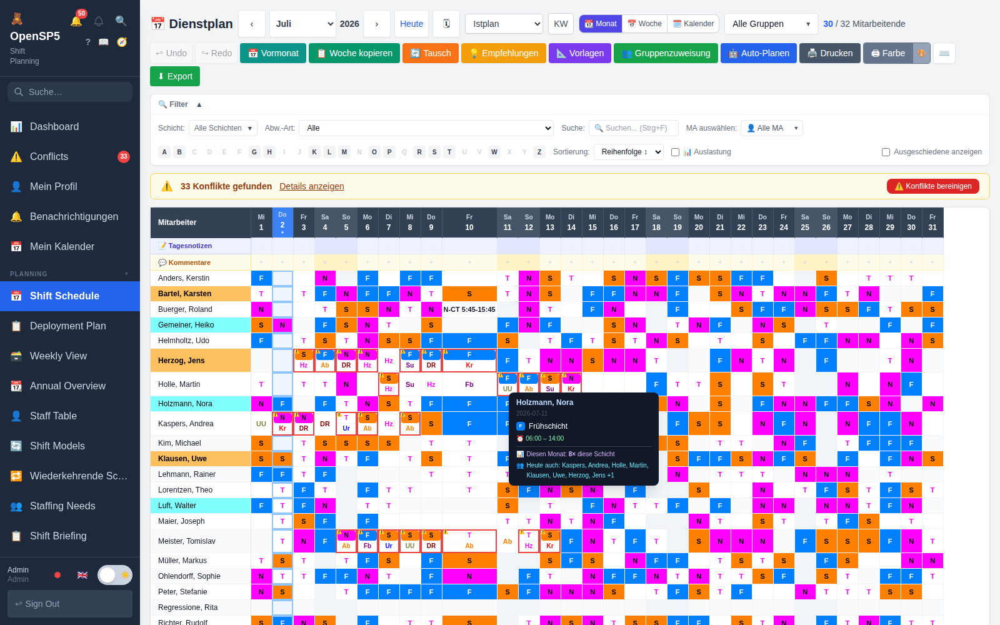
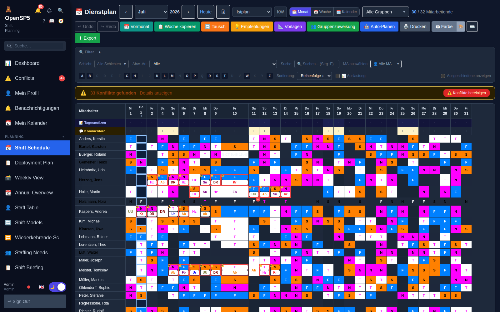

# Design-System — Tokens, Primitives, Regeln

Stand: Juli 2026. Herleitung: [ux-audit.md](ux-audit.md) (systemische
Wurzelklassen der Echtdaten-Befundserie). Ziel: die dort belegten
Fehlerklassen (unlesbarer Text auf Farbflächen, helle Dark-Mode-Flächen,
Sortier-/Beschriftungs-Drift, Modal-Wildwuchs) können strukturell nicht
wiederkehren, weil EINE Quelle sie erzwingt.

## 1. Design-Tokens (`frontend/src/index.css`)

24 `--color-*`-Tokens, jedes als **Light/Dark-Paar** (`:root` / `html.dark`).
Flächen (`surface`–`surface3`, `bg`), Text (`text`–`text3`, `-muted`,
`-subtle`), Ränder, Eingaben, Status (`warn-*`, `danger-*`, `success-*`),
Schatten.

**Kontrast-Garantie:** `src/__tests__/tokens.contrast.test.ts` parst die CSS
und prüft jede Text-auf-Fläche-Kombination in beiden Modi gegen WCAG AA
(4,5:1; `text-subtle` als Dekorations-/UI-Grenze 3:1). Eine Token-Änderung,
die Kontrast bricht, macht die Suite rot. (Beim Einführen des Tests wurden
zwei echte Light-Verstöße gefunden und korrigiert.)

Regeln:
- Neue Farben NUR als Token-Paar, nie als Roh-Hex in Komponenten.
- Dark-Mode NUR über das Token-Paar bzw. Tailwind-`dark:`-Klassen — keine
  `isDark ?`-Ternaries, kein `html.dark`-Sonder-CSS pro Seite.
- Nicht existierende Tailwind-Shades (z. B. `slate-750`) scheitern still —
  nur Standard-Stufen verwenden.

## 2. Dynamische Farbflächen (Schicht-/Abwesenheits-/MA-Farben)

`utils/contrast.ts` → `readableTextColor(bgHex)`: wählt schwarz/weiß nach
exakt der Server-Formel (`sp5lib.color_utils.is_light_color`,
Rec.-601-Luminanz, Schwelle 0,5) — Frontend und PDF-/Berichts-Seite
entscheiden identisch (Kreuzcheck als Test).

## 3. Primitives (`frontend/src/components/ui/`)

| Primitive | Zweck | Garantien |
|---|---|---|
| `Badge` | Farb-Chips (Schicht, Abwesenheit, MA) | feste Höhe, truncate — läuft nie über; Auto-Kontrast |
| `Modal` | Anzeige/Bestätigung | ESC, Backdrop, Fokus-Falle, Fokus-Rückgabe |
| `FormModal` | Formulare | wie Modal + Submit/Fehler/Spinner |

Zentrale Sortierung `utils/sortOrder.ts` (original-treu, per Wine-Orakel
belegt): `byNameFirstname` (MA-Listen), `byPosition` (Stammdaten-Zeilen),
`byStartTimeThenName` (Tageskontext), `deCompare` (deutsche Kollation).
Gruppen-Dropdowns über `utils/groupTree.ts` (Baum, „Alle Gruppen").

Die verbindliche Kurzfassung für Entwickler liegt in
`frontend/src/components/ui/README.md`.

## 4. Referenz-Ansicht (Review-Punkt)

Der **Dienstplan** ist die Referenz: er nutzt die Token-Flächen, die
serverseitig kontrastierten Zellfarben und die original-treue Sortierung.
Screenshots (synthetischer Datensatz, 30 MA):

## 5. Migrations-Strategie (Phase 4)

Ansichtsweise, chirurgisch (Funktion unverändert, Screenshots light+dark je
Ansicht), Priorität nach Nutzungshäufigkeit: Einsatzplan → Urlaub →
Stammdaten-Seiten → Berichte → Rest. Pro Ansicht: Eigenbau-Badges → `Badge`,
Eigenbau-Overlays → `Modal`/`FormModal`, lokale sorts → `sortOrder`,
`isDark`-Ternaries → Token/`dark:`-Paare. KEIN Big-Bang; jede Migration ist
ein eigener, getesteter Commit.

## 6. Stehende Regel

Neue oder geänderte UI verwendet Tokens + Primitives. Pro-Seite-Eigenbau von
Tabellen-Sortierung, Badges, Modals oder Dark-Mode-Sonderwegen gilt als
Verstoß und wird im Review zurückgewiesen.
