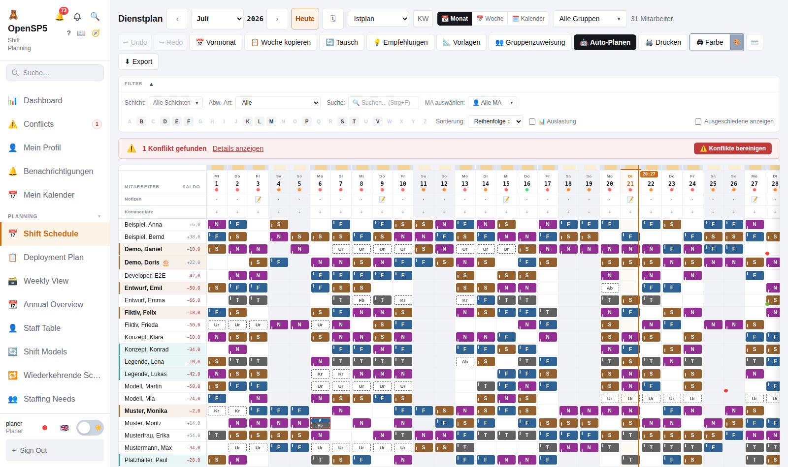
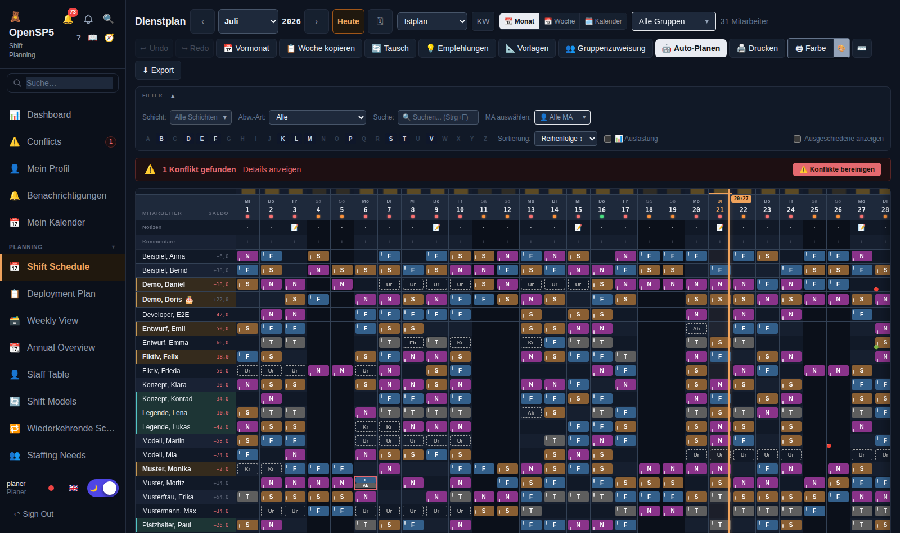

# Design-System „Taktwerk"

Stand: Juli 2026. Quelle: verbindlicher Design-Handoff des Maintainers
(„Taktwerk", Richtung 1b — High-Fidelity: Hex-Werte, Größen, Abstände und
Zustände sind final; einzige Freiheit sind Icon-Glyphen, die über die
vorhandene Icon-Bibliothek umgesetzt werden). Leitidee: **Zeit ist die
Struktur** — das UI macht Tageszeit und Schichtrhythmus sichtbar (Zeitfaden,
Tagbogen, Phasenkerben) statt neutral-generisch zu sein. Informationsdichte
ist Feature: 30+ Mitarbeiter × 31 Tage ohne Struktur-Scrolling. Light UND
Dark gleichwertig, Dark ist Erstmodus. Nur System-Schriften.

Das frühere, selbst hergeleitete Token-System (`--color-*`) bleibt als
Legacy bestehen, bis alle Ansichten migriert sind (siehe §9); neue UI-Arbeit
verwendet ausschließlich Taktwerk.

## 1. Design-Tokens (`frontend/src/index.css` + `tailwind.config.js`)

15 Token, jedes als **Light/Dark-Paar** (`:root` / `html.dark`), in Tailwind
gemappt (`bg-ebene text-schrift border-kontur …`):

| Token | Light | Dark | Verwendung |
|---|---|---|---|
| `grund` | `#f4f5f8` | `#0e1420` | App-Hintergrund |
| `ebene` | `#ffffff` | `#111927` | Karten, Raster, Panels |
| `ebene-2` | `#ffffff` | `#16202f` | Overlays, Inputs |
| `rail` | `#ffffff` | `#0b101a` | Navigations-Rail |
| `kontur` | `#e3e5eb` | `#232c3d` | Trennlinien, Borders |
| `kontur-soft` | `#edeff4` | `#1b2434` | Zell-Hairlines im Raster |
| `wash` | `#f0f2f6` | `#0b101a` | Wochenend-Spalten, Zeilenkopf-Flächen |
| `schrift` | `#15171c` | `#e9ecf2` | Primärtext |
| `schrift-2` | `#666c78` | `#939cad` | Sekundärtext, Meta |
| `schrift-3` | `#8a90a0` | `#646b7c` | Labels, Platzhalter |
| `glut` | `#c96a14` | `#f0a35c` | Jetzt-Faden, Heute, Fokus/Cursor, Auswahl, aktive Nav |
| `glut-flaeche` | `#fdf3e7` | `#20180e` | Heute-Spalte-Kopf, aktive Nav-Fläche |
| `glut-ink` | `#ffffff` | `#1a1108` | Text auf Glut-Chips |
| `signal` | `#be3b3b` | `#e4696f` | Konflikt-Ringe, negative Salden, Error |
| `signal-flaeche` | `#fbf1f1` | `#1d0f12` | Konflikt-Badge (Border dark `#5a2626` / light `#eecfcf`) |

Regeln:

- Chrome kennt genau ZWEI Chroma-Farben: **Glut** (Zeit/Fokus) und **Signal**
  (Konflikt). Alles andere ist neutral.
- Primär-Buttons sind **Umkehrung** (light `#15171c`-Fläche/weißer Text, dark
  `#e9ecf2`-Fläche/dunkler Text), NICHT Glut.
- Auswahl-Wanne: Glut mit Alpha — light `rgba(201,106,20,.10)`, dark
  `rgba(240,163,92,.13)`. Hover-Tönung Zeile/Spalte: light
  `rgba(21,23,28,.028)`, dark `rgba(233,236,242,.035)`.
- Neue Farben NUR als Token-Paar, nie als Roh-Hex in Komponenten; Dark-Mode
  über `dark:`-Klassen bzw. die Variablen, keine `isDark ?`-Ternaries.

**Kontrast-Garantie:** `src/__tests__/taktwerk.tokens.contrast.test.ts` parst
die CSS und fixiert die Garantien (Primärtext ≥ 4,5:1 auf allen Flächen,
Signal-Text ≥ 4,5:1, Chip-/Flächen-Kombinationen ≥ 3:1) in beiden Modi.

## 2. Typografie (nur System-Stacks)

| Rolle | Stack | Größe/Zeile | Gewicht |
|---|---|---|---|
| Display (Seitentitel) | `system-ui, -apple-system, 'Segoe UI', sans-serif` | 20/24, letter-spacing −2% | 800 |
| Titel klein (Panel) | dito | 15–16/20, −1% | 700–800 |
| Body | dito | 13/20 | 400 |
| UI-Beschriftung | dito | 11.5/16 | 400–600 |
| Labels/Sections | dito, UPPERCASE | 9–10, letter-spacing +8–12% | 700–800 |
| **Zeit & Zahlen** | `ui-monospace, 'SF Mono', 'Cascadia Mono', Consolas, monospace` + `font-variant-numeric: tabular-nums` | 9–11.5 | 500–700 |

Alle Uhrzeiten, Salden, Zähler, KW-Nummern und Kbd-Hints laufen in Monospace
mit Tabellenziffern (`font-mono`).

## 3. Abstände, Radius, Elevation

- Spacing-Skala: **4 · 8 · 12 · 16 · 24**
- Radius: **2px** Zellen-Chips (3px innen = `rounded-cell`), **6px**
  Buttons/Inputs (`rounded-ui`), **7–8px** Flächen/Menüs (`rounded-panel`),
  **10px** App-Frame
- Elevation: Flächen = 1px Kontur, KEINE Schatten. Nur Overlays (Menü,
  Dialog, Toast): `shadow-overlay` light / `shadow-overlay-dark` dark.

## 4. Mitarbeiter-/Schichtfarben (`frontend/src/utils/shiftColor.ts`)

Nutzerfarben kommen roh aus der DBF (oft Vollton) und werden NIE roh
gerendert:

1. **Hue behalten** — Wiedererkennung („der Grüne bleibt der Grüne").
2. **S/L auf Schiene**: Light `hsl(h, 52%, 38%)`, Dark `hsl(h, 46%, 37%)` —
   ein Lautstärkepegel für alle.
3. **Vordergrund berechnen, nie setzen**: WCAG-Kontrast Schwarz `#131315`
   vs. Weiß `#ffffff` gegen die Fläche, Gewinner nimmt's.
4. **Hohl-Variante für Abwesenheiten**: kein Füllkörper, gestrichelte Kontur
   + Text in `hsl(h, 60%, 34%)` light / `hsl(h, 55%, 66%)` dark.
5. **Kollisions-Spreizung**: Hues < 14° Abstand werden deterministisch
   gespreizt (`spreadHues`).
6. **Drei Lautstärken**: Voll (Rasterzellen), Tint (Zeilenköpfe, Karten,
   Personen-Badges; `hsl(h,45%,94%)`/`hsl(h,30%,16%)` + 3px-Spine), Spine
   (nur die 3px-Kante, `hsl(h,55%,42%)`/`hsl(h,50%,55%)`).

**Achromat-Sonderfall (Präzisierung, vom Maintainer bestätigt):** (nahezu) graue
Rohfarben (Sättigung < 8 %) haben keinen Farbton — die Hue-Schiene würde sie
rot einfärben und z. B. Zeitausgleich `#808080` ununterscheidbar von Krank
`#FF0000` machen. Die Wiedererkennungs-Regel gilt sinngemäß: der Graue bleibt
grau (S=0 auf derselben Helligkeits-Schiene); Achromaten nehmen auch nicht an
der Kollisions-Spreizung teil.

**AA-Nachführung (Präzisierung, vom Maintainer bestätigt):** Für Grün-/Cyan-Hues erreicht
die nominelle Schiene mit keinem Ink-Ton 4,5:1 (light worst 4,34 bei h≈189,
dark 4,31 bei h≈136) — dort hat die im Handoff zweifach zugesicherte
AA-Garantie Vorrang: `normalize` senkt L nur für diese Hues in 1%-Schritten
ab, bis der beste Vordergrund AA erreicht (max. −2%). Alle übrigen Hues
bleiben exakt auf der Schiene. Testfest in
`src/__tests__/shiftColor.test.ts` (voller Hue-Sweep, beide Modi).

Laufzeit-Regel: Ergebnisse pro (Rohfarbe, Modus) memoisieren —
`shiftCellColorsMemo` verwenden, nie `normalize` direkt im Render-Pfad.
Normalisierte Farben sind Laufzeitwerte → inline `style`; alles andere über
Tailwind-Klassen.

## 5. Interaktions-Grundsätze

Timing: alles ≤ 140ms (Kontextmenü 90ms, Toast 140ms, Chip-Transition 80ms),
nur `ease-out`, keine Bounce/Spring-Effekte. Tastatur ist gleichwertiger
Eingabeweg (Cursor-Zelle, Bereichsauswahl, Ziffern-Schnelleingabe, Esc-
Kaskade); Aktionen wirken auf den Bereich, falls vorhanden, sonst auf die
Cursor-Zelle. Undo/Redo als Command-Stack — jede Mutation (auch Multi-Zell)
ist ein Schritt.

## 6. Taktwerk-Komponenten-Muster (Soll für T2/T3)

- **Dienst-Chip/Badge**: Fixhöhe, `max-width` + Ellipsis — läuft nie über;
  Dienste = gefüllte Chips, Abwesenheiten = gestrichelte Hohl-Chips,
  farblose Dienste = Text in Schrift-2. Phasenkerbe (2×7px, Position oben/
  Mitte/unten = Früh/Spät/Nacht) macht Schichtfolgen als Silhouette lesbar.
- **Dienstplan-Raster**: Geometrie fix, nie inhaltsabhängig (Namensspalte
  178px, Tagesspalten 42px, Zeilen 25px; Jahresraster 21×20px); Tagbogen
  (Tageslicht-Gradient je Spalte), Zeitfaden (Glut-Linie an der
  Jetzt-Position), Heute/Wochenende/Feiertag als Spalten-Zustände;
  ∑-Fußzeile mit Unterbesetzung in Signal.
- **Datentabelle**: Zeilen 28px, Kopf UPPERCASE 9px/700, aktive Sortspalte
  Schrift-1 + Glut-Pfeil, Zahlen rechtsbündig Monospace, EINE Sortierlogik.
- **Baum-Select**: Panel mit Suchfeld, Baumzeilen 27px, Checkbox 13px
  (checked/mixed = Glut), Kbd-Footer.
- **Dialog**: Kopf 13px/700 + Esc-Hint; Footer: Destruktives links in
  Signal, rechts Abbrechen (Outline) + Speichern (Umkehrung).
- **Kontextmenü**: 208–224px, Kopf Name + Datum·KW, Items 26–27px, Hover =
  Glut-Wanne, `pop .09s ease-out`.
- **Empty/Loading/Error**: Skeleton im Zeilenrhythmus des Ziel-Layouts
  (`shimmer 1.2s`, gestaffelt); Error mit letztem Stand + Aktionen.
- **Navigation**: expandiert 212px / Rail 52px; aktiv = Glut-Fläche +
  Glut-Text + 3px-Spine; Konflikt-Badge in Signal.

## 7. Bestehende Primitives (Ist — werden auf Taktwerk migriert)

`frontend/src/components/ui/` (`Badge`, `Modal`, `FormModal`, …; Kurzfassung
in `frontend/src/components/ui/README.md`) sowie `utils/contrast.ts` bleiben
funktional in Kraft, bis die jeweilige Ansicht migriert ist. Ihre Garantien
(Badge läuft nie über, Modal mit Fokus-Falle) gelten unverändert und werden
bei der Migration in die Taktwerk-Optik überführt.

Zentrale Sortierung `utils/sortOrder.ts` (original-treu, per Wine-Orakel
belegt): `byNameFirstname`, `byPosition`, `byStartTimeThenName`, `deCompare`.
Gruppen-Dropdowns über `utils/groupTree.ts`. Beides gilt unter Taktwerk
unverändert.

## 8. Referenz-Ansicht (Review-Punkt)

Der **Dienstplan (Monats-Grid, light + dark)** ist die Taktwerk-
Referenz-Ansicht und der Review-Zwischenstand für den Maintainer, bevor die
Migration in die Fläche geht. Die Screenshots zeigen die umgesetzte Referenz
(synthetischer Demo-Datensatz, Juli 2026): Tagbogen, Zeitfaden, normalisierte
Chips mit Phasenkerben, hohle Abwesenheiten, Glut-Navigation, Signal-Konflikt:

## 9. Migrations-Stand & Strategie

- **T1 Fundament — umgesetzt:** Token als CSS-Variablen + Tailwind-Mapping,
  `shiftColor.ts` (memoisiert, mit Spreizung), Kontrast-/Algorithmus-Tests.
- **T2 Referenz-Ansicht Dienstplan (light+dark) — umgesetzt** (§8): Fixraster
  42/25/178 px, Chip-Anatomie mit Phasenkerbe, Tagbogen, Zeitfaden,
  Hover-Kreuz (imperativ, ohne Grid-Re-Render), Zustands-Kaskade,
  Header/Menüs/App-Shell tokenisiert; browser-verifiziert light+dark
  (13 Struktur-Beweise, 0 Seitenfehler). Jetzt Maintainer-Review.
- **T3 Flächige Migration** aller Ansichten + Primitives (§6), ansichtsweise
  und chirurgisch (Funktion unverändert; Screenshots light+dark je Ansicht;
  jede Migration ein eigener, getesteter Commit; kein Big-Bang), Priorität
  nach Nutzungshäufigkeit: Einsatzplan → Urlaub → Stammdaten → Berichte →
  Rest. Beim Abschluss einer Ansicht: deren `--color-*`-/`isDark`-Reste
  entfernen.
- **T4 Baum-Select** als gemeinsames Primitive (löst
  [design-multiselect.md](design-multiselect.md) ein).

## 10. Stehende Regel

Neue oder geänderte UI verwendet Taktwerk-Tokens + Primitives. Pro-Seite-
Eigenbau von Tabellen-Sortierung, Badges, Modals, Farb-Mathematik oder
Dark-Mode-Sonderwegen gilt als Verstoß und wird im Review zurückgewiesen.
